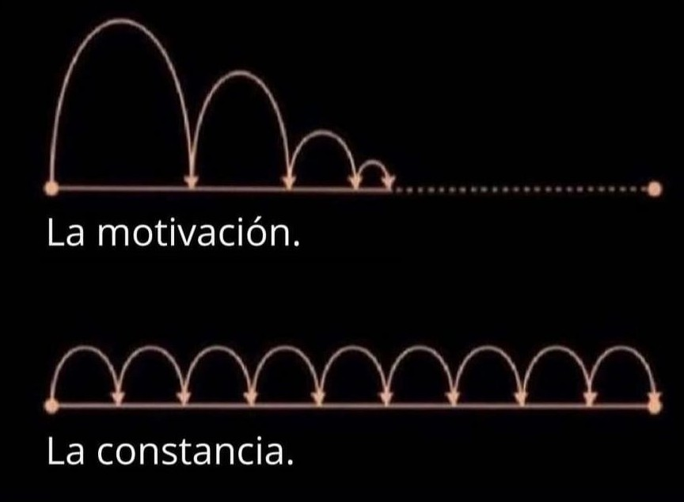

Método del Pájaro Carpintero 🪵🔨

[Volver a Inicio](../../README.md)

> Es una técnica de estudio o trabajo enfocada en la constancia, ritmo y repetición regular, muy parecida a cómo trabaja un pájaro carpintero: sin hacer grandes esfuerzos de una sola vez, pero golpeando de forma persistente y con enfoque en un mismo punto hasta lograr un resultado.

## 🧠 ¿En qué consiste?
- Sesiones cortas pero regulares: estudiar o trabajar todos los días aunque sea poco tiempo (por ejemplo, 30 minutos).
- Sin interrupciones: enfoque sostenido durante ese lapso.
- Persistencia: se valora más la regularidad diaria que los "maratones" ocasionales.
- Acumulación de progreso: los avances parecen pequeños, pero se suman con el tiempo.

## ✅ Ventajas
- Reduce la procrastinación.
- Favorece la memoria a largo plazo.
- Te mantiene en contacto diario con el contenido.
- Es ideal para hábitos intelectuales (como programar, escribir, estudiar idiomas o música).

[Volver a Inicio](../../README.md)