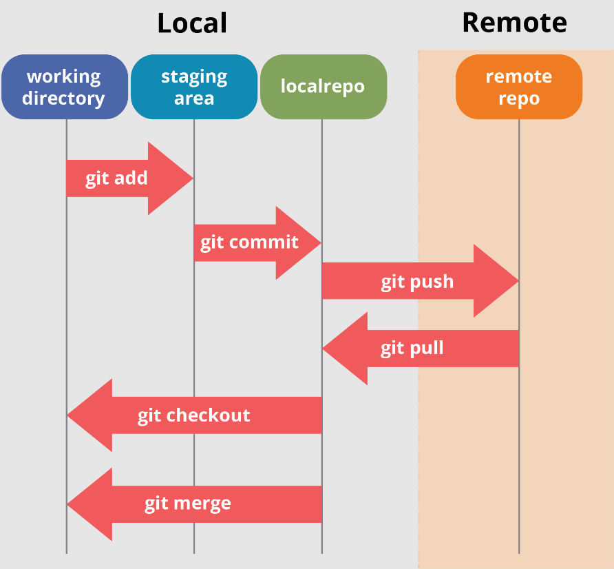

## Flow Git y Áreas

[Volver a Inicio](../../README.md)

- Entender el **flujo de trabajo de Git** entre el área de trabajo y el _staging area_ (también llamada "índice") es clave para usar Git de manera efectiva.
- Git trabaja con las siguientes Áreas:
  1.  **Working Directory** (Área de trabajo)
      - Es tu carpeta real donde trabajas. Aquí editas, creas y borras archivos.
      - Cuando editas un archivo, Git lo marca como **modificado**.
      - Git todavía **no lo va a guardar en el historial** hasta que lo prepares para el commit.
  2.  **Staging Area** (Índice)
      - Es un espacio intermedio donde "preparas" los archivos para el commit.
      - Aquí van los archivos que tú **seleccionas con `git add`**.
      - Te permite controlar qué cambios exactos entrarán en el próximo commit (puedes dejar otros cambios afuera).
  3.  **Repositorio (local)**:
      - Cuando haces `git commit`, Git toma lo que está en el _staging area_ y lo guarda como un nuevo **commit permanente** en el historial.
- Flow de Git

```txt
    +-----------------------+
    |   Repositorio local   |
    |     (Commits)         |
    +-----------------------+
                ▲
                | ← git commit
                ▼
    +-------------------+
    |  Staging Area     |
    +-------------------+
                ▲
                | ← git add
                ▼
    +-----------------------+
    | Working Directory     | editas archivo/s
    |  (Área de trabajo)    |
    +-----------------------+
```



[Volver a Inicio](../../README.md)