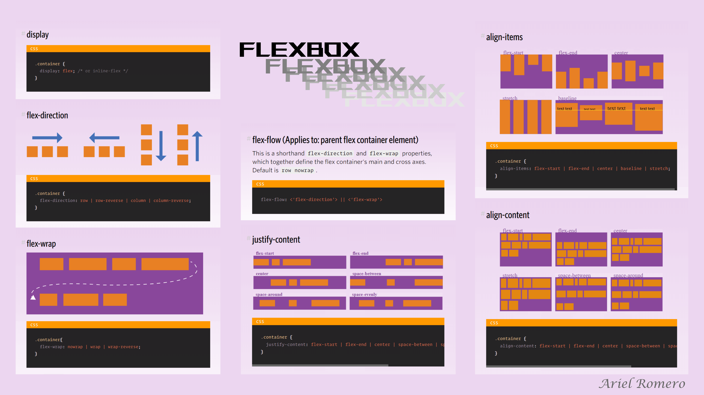

# 📚 RESET & NORMALIZE

- El archivo `reset.css` (o _reset stylesheet_) tiene como **función principal eliminar o "resetear" los estilos predeterminados** que los navegadores aplican por defecto a los elementos HTML.
- Cada navegador tiene su propia hoja de estilos por defecto (por ejemplo, márgenes en el `<body>`, tamaño y estilo de encabezados, etc.). Esto puede causar **inconsistencias en el diseño** de una página web dependiendo del navegador usado.
- El `reset.css` busca **nivelar esas diferencias** para que todos los elementos partan desde una base común de estilos.
- 🎯 Objetivos del `reset.css`:
  - Eliminar márgenes y rellenos por defecto (`margin`, `padding`).
  - Asegurar que todos los elementos tengan `box-sizing: border-box` (en algunos resets modernos).
  - Normalizar tamaños de fuente y estilos de texto.
  - Evitar diferencias entre navegadores en estilos de listas, encabezados, formularios, etc.
- 🆚 ¿Reset o Normalize?
  - **reset.css**: elimina todos los estilos por defecto.
  - **normalize.css**: no los elimina, sino que los **armoniza** entre navegadores.
    - Normalize: https://necolas.github.io/normalize.css/
  - Ambos tienen el mismo objetivo (consistencia), pero lo hacen de maneras distintas.

# 📚 BOX MODEL (Modelo de Caja)

- Todo elemento en una página web es una caja que está compuesta por:
  - content El contenido real del elemento (texto, imagen, etc.)
  - padding Espacio entre el contenido y el borde
  - border Borde que rodea el padding y el contenido
  - margin Espacio externo, entre el borde y otros elementos


## 🧮 Cálculo total del ancho/alto:

- Por defecto, el tamaño total de una caja es:
  - ancho total = content + padding + border + margin

# 📚 ELEMENTOS DE BLOQUE Y EN LÍNEA

En HTML, los elementos se dividen principalmente en dos grandes categorías según su comportamiento en el flujo del documento:

## 🧱 Elementos de bloque (block-level)

🔹 Características:

- Ocupan todo el ancho disponible de su contenedor.
- Siempre comienzan en una nueva línea.
- Pueden contener otros elementos en línea y otros elementos de bloque (en muchos casos).

📌 Ejemplos comunes:

- `<div>, <p>, <h1> al <h6>, <ul>, <ol>, <li>, <section>, <article>, <header>, <footer>, <nav>, <main>, <form>, <table>`

## 🔠 Elementos en línea (inline)

🔹 Características:

- Solo ocupan el espacio necesario según su contenido.
- No comienzan en una nueva línea.
- No pueden contener elementos de bloque (solo texto u otros elementos en línea).

📌 Ejemplos comunes:

- `<span>, <a>, <strong>, <em>, , <label>, <input>, <br>, <small>, <abbr>, <code>`

## ⚠️ Otros tipos:

🔸 Inline-block

- Se comporta como inline en el flujo del documento, pero permite definir ancho y alto como un block.

```css
display: inline-block;
```

## 🧪 ¿Cómo saber qué tipo es?

Podés usar herramientas de desarrollador del navegador (clic derecho → "Inspeccionar") o simplemente ver su estilo por defecto en los navegadores.

# 📚 FLEXBOX

